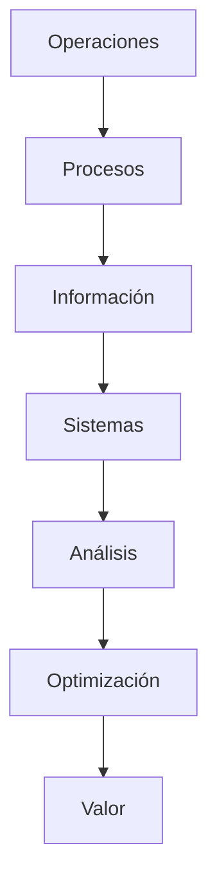

# Juan Araya | Análisis de Sistemas · Industrial IT · Ingeniería en Sistemas

<div align="center">

### *Integrando Industria, Operaciones y Sistemas de Información*

**Estudiante de Ingeniería en Sistemas de Información — UTN FRC**
Industrial IT · Análisis de Sistemas · Gestión Técnica · Inteligencia Operacional


</div>

---

# 🚀 Sobre Mí

Tengo **19 años** y soy estudiante de **Ingeniería en Sistemas de Información** en la **Universidad Tecnológica Nacional — Facultad Regional Córdoba**, actualmente cursando el tramo intermedio de la carrera.

Mi perfil profesional está orientado mucho más allá del desarrollo aislado de software.
Me interesa especialmente la integración entre:

* **Análisis de Sistemas**
* **Procesos Operativos**
* **Infraestructura Tecnológica**
* **Gestión Técnica**
* **Industrial IT**
* **Información y Operaciones**
* **Optimización de Procesos**

Combino formación universitaria con experiencia práctica en entornos técnicos y operativos reales, donde la organización, la trazabilidad, la calidad y la lógica de sistemas son fundamentales.

Mi objetivo es crecer como profesional capaz de conectar tecnología, procesos, operaciones e información dentro de ecosistemas complejos.

---

# 🧠 Perfil Profesional

```txt id="2t8n5m"
✔ Mentalidad orientada a sistemas
✔ Comprensión operativa e industrial
✔ Pensamiento analítico y estructurado
✔ Capacidad de documentación técnica
✔ Adaptabilidad y aprendizaje rápido
✔ Visión de optimización de procesos
✔ Responsabilidad técnica en entornos exigentes
✔ Integración entre IT, operaciones y gestión
✔ Proyección profesional a largo plazo
```

---

# 🌐 Visión de Ingeniería

> “La ingeniería moderna no se construye únicamente escribiendo código, sino comprendiendo cómo interactúan los sistemas, las operaciones, las personas y la información.”

Mi objetivo profesional a largo plazo es especializarme en áreas donde la tecnología impacta directamente sobre operaciones reales:

* Industrial IT
* Sistemas Empresariales
* Infraestructura Tecnológica
* Inteligencia Operacional
* Optimización de Procesos
* Arquitectura de Sistemas
* Sistemas Industriales
* Gestión Técnica
* Tecnología aplicada a operaciones

---

# 🎓 Formación Académica

## Universidad Tecnológica Nacional — Facultad Regional Córdoba

### Ingeniería en Sistemas de Información

📍 Córdoba, Argentina
📖 Estudiante intermedio — 3.er año

### Áreas Principales de Formación

* Análisis de Sistemas
* Ingeniería de Software
* Bases de Datos
* Sistemas Operativos
* Arquitectura de Computadoras
* Redes y Comunicaciones
* Gestión Organizacional
* Modelado de Sistemas
* Algoritmos y Estructuras de Datos
* Gestión de la Información

---

# ⚙️ Stack Técnico

## 💻 Programación y Desarrollo


---

## 🧩 Backend, APIs y Arquitectura


---

## 🗄️ Bases de Datos y Gestión de Información


---

## 🖥️ Infraestructura, Sistemas y DevOps


---

## 🏭 Industrial IT y Tecnología Operacional


---

## 📊 Ingeniería, Análisis y Metodologías


---

# 💼 Experiencia Profesional

## 🖥️ Soporte Técnico y Asistencia de Sistemas — **Freelance / Servicios Técnicos Independientes**

Actualmente realizando asistencia técnica independiente y soporte operativo orientado a entornos de usuario, continuidad operativa e infraestructura tecnológica.

### Responsabilidades Principales

* Soporte técnico en entornos Windows
* Instalación y configuración de software
* Diagnóstico y resolución de problemas
* Asistencia técnica a usuarios
* Soporte básico de redes y conectividad
* Mantenimiento de equipos y entornos operativos
* Documentación técnica y organización operativa

### Experiencia Adquirida

```txt id="3h7d8p"
• Resolución técnica de problemas
• Diagnóstico de sistemas
• Comprensión de infraestructura IT
• Comunicación técnica
• Adaptabilidad operativa
• Organización de procesos
• Soporte orientado al usuario
• Continuidad operativa
```

---

## 🔧 Experiencia Previa — **Grupo Renault**

### Operario Electromecánico Industrial

Participación en entornos industriales automotrices de alta exigencia, bajo estándares técnicos, operativos y de seguridad.

### Responsabilidades Principales

* Participación en procesos productivos industriales
* Interacción con sistemas operativos y electromecánicos
* Cumplimiento de procedimientos técnicos y de calidad
* Comprensión de flujos operativos y trazabilidad
* Trabajo coordinado bajo presión operativa

### Experiencia Adquirida

```txt id="8d9s1k"
• Disciplina operativa industrial
• Comprensión de procesos productivos
• Responsabilidad técnica
• Ejecución orientada a calidad
• Lógica operacional industrial
• Trabajo técnico en equipo
```

---

## 🚗 Experiencia Previa — Auditoría Técnica Automotriz para **Grupo Renault**

### Auditor de Calidad y Validación Vehicular

Tareas de validación técnica y control de calidad dentro del sector automotriz.

### Responsabilidades Principales

* Inspección y validación de vehículos
* Evaluación técnica y análisis de fallas
* Elaboración de informes y documentación
* Verificación de estándares industriales
* Control de calidad y trazabilidad

### Experiencia Adquirida

```txt id="7g4f0m"
• Pensamiento analítico
• Evaluación técnica
• Criterio de control de calidad
• Atención al detalle
• Interpretación de estándares
• Documentación operativa
```

---

# 📊 Competencias Técnicas

| Área                 | Competencia                              |
| -------------------- | ---------------------------------------- |
| Análisis de Sistemas | Comprensión funcional y operativa        |
| Infraestructura      | Entornos Windows/Linux                   |
| Redes                | Conectividad y comunicación              |
| Bases de Datos       | Lógica relacional y SQL                  |
| APIs                 | Integración e interacción entre sistemas |
| Industrial IT        | Operaciones, trazabilidad y control      |
| Documentación        | Técnica, funcional y operativa           |
| Gestión de Procesos  | Interpretación y optimización            |
| Trabajo en Equipo    | Coordinación en entornos exigentes       |

---

# 🧩 Mentalidad de Ingeniería



---

# 📈 Proyección Profesional

Interesado en roles orientados a:

* Analista de Sistemas
* Industrial IT
* Gestión Técnica
* Infraestructura Tecnológica
* Sistemas Empresariales
* Tecnología Operacional
* Optimización de Procesos
* Coordinación Técnica
* Inteligencia Operacional
* Consultoría Tecnológica

---

# 🌍 Objetivo Profesional

Convertirme en un profesional capaz de integrar:

```txt id="4v0f8a"
Tecnología + Operaciones + Información + Ingeniería
```

mediante sistemas escalables, pensamiento analítico y comprensión real de procesos operativos.

---

# 📫 Contacto

<div align="center">

[](mailto:juancearaya@gmail.com)
[](https://www.linkedin.com/in/juan-araya-212a0b24b/)
[](https://www.instagram.com/juanarayaa_)

</div>

---

<div align="center">

### *Construyendo sistemas más allá del código.*

</div>
